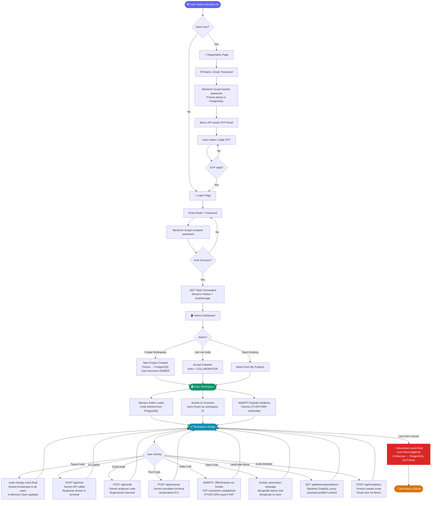
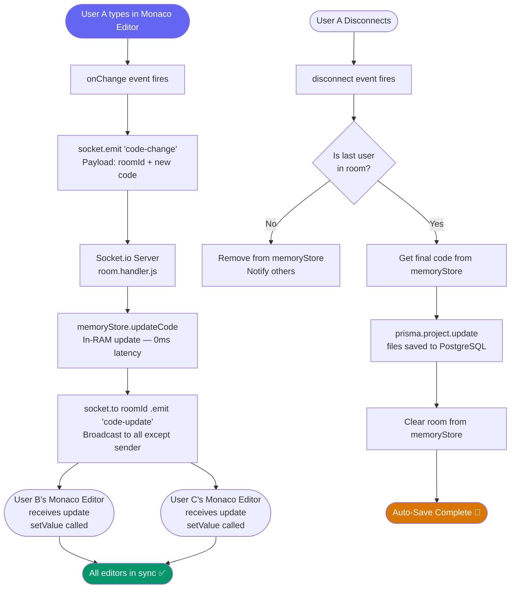
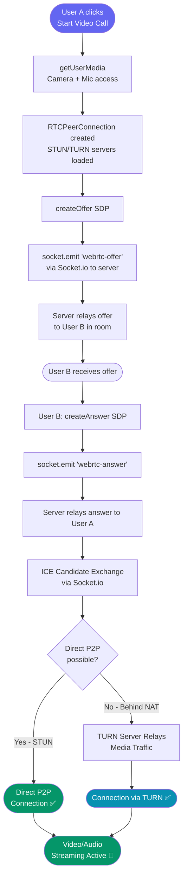

# DevSync AI — Complete Project Workflow Flowchart
### For Interview Explanation (Hinglish Talking Points)

---

## 🗺️ MASTER FLOWCHART — Complete User Journey

---

## 🔐 FLOWCHART 1 — Authentication Flow (Detail)

```mermaid
flowchart LR
    A([User]) --> B[POST /api/auth/register]
    B --> B1[Rate Limiter Check\n5 requests/15 min]
    B1 --> B2[bcrypt.hash password\nsalt rounds = 10]
    B2 --> B3[prisma.user.create\nPostgreSQL insert]
    B3 --> B4[Generate 6-digit OTP\nStore in memoryStore\nExpiry = 10 minutes]
    B4 --> B5[Brevo HTTP API\nSend OTP Email]
    B5 --> C([OTP Received])

    C --> D[POST /api/auth/verify-otp]
    D --> D1{OTP match\n+ not expired?}
    D1 -->|No| E([Error: Invalid OTP])
    D1 -->|Yes| D2[Mark user verified\nClear OTP from memory]
    D2 --> F([Registration Complete])

    F --> G[POST /api/auth/login]
    G --> G1[prisma.user.findUnique]
    G1 --> G2[bcrypt.compare]
    G2 --> G3{Match?}
    G3 -->|No| H([401 Unauthorized])
    G3 -->|Yes| G4[jwt.sign with JWT_SECRET\nExpiry = 7 days]
    G4 --> I([Token sent to client\nRedux state updated])

    style A fill:#6366f1,color:#fff
    style I fill:#059669,color:#fff
    style E fill:#dc2626,color:#fff
    style H fill:#dc2626,color:#fff
```

---

## ⚡ FLOWCHART 2 — Real-Time Code Sync Flow

---

## 🤖 FLOWCHART 3 — AI Copilot Flow

```mermaid
flowchart LR
    A([User types prompt\nin Copilot panel]) --> B[handleCopilotSubmit\nWorkspace.jsx]
    B --> C[Build chatHistory array\nfrom previous logs]
    C --> D[POST /api/chat\nauth-token header]
    D --> E[fetchuser middleware\nJWT verify]
    E --> F[ai.controller.js\nchat function]
    F --> G[Build apiMessages:\nSystem prompt + code context\n+ full chat history]
    G --> H[Gemini API call\ngemini-3.6-flash\nmax_tokens: 2048\ntemp: 0.5]
    H --> I([AI Response])
    I --> J[res.json reply]
    J --> K[setCopilotLogs update\nDisplay in terminal UI]
    K --> L([User sees full code\nin Copilot panel ✅])

    style A fill:#6366f1,color:#fff
    style L fill:#059669,color:#fff
    style H fill:#7c3aed,color:#fff
```

---

## 📹 FLOWCHART 4 — WebRTC Video Call Flow

---

## 🗣️ INTERVIEW TALKING SCRIPT — Step by Step

### Step 1: Jab Interviewer puche "Project explain karo"

> *"Sir, DevSync AI ek real-time collaborative IDE hai. Main aapko iske complete workflow ke through walk karta hoon."*

---

### 📍 PHASE 1 — User Registration & Auth

**Kya bolna hai:**
- **"Pehla step user registration hai."**
- "Jab user sign up karta hai, uska password `bcrypt` se **hash** hota hai — plain text kabhi store nahi hoti."
- "Phir `Prisma ORM` se PostgreSQL mein `user.create` call hoti hai."
- "Ek 6-digit **OTP** generate hota hai jo `memoryStore` (server ki RAM) mein temporarily 10 minutes ke liye store hota hai."
- "Ye OTP **Brevo HTTP API** se email pe bheja jata hai — SMTP nahi use kiya kyunki Render jaise cloud platforms SMTP ports block karte hain."
- "OTP verify hone ke baad JWT token generate hota hai jo client side pe **Redux state** aur `localStorage` mein store hota hai."

**🔑 Key Terms to use:** `bcrypt`, `Prisma ORM`, `memoryStore`, `Brevo HTTP API`, `JWT`, `Redux`

---

### 📍 PHASE 2 — Workspace Entry

**Kya bolna hai:**
- **"Jab user workspace open karta hai, teen cheezein simultaneously initialize hoti hain."**
- "**Pehla:** Monaco Editor load hota hai — code PostgreSQL se fetch karke editor mein set hota hai."
- "**Doosra:** Socket.io connection establish hoti hai. Client `socket.emit('join-room')` karta hai apne workspace ID ke saath."
- "**Teesra:** WebRTC module initialize hota hai — STUN/TURN server credentials backend se fetch hote hain."

**🔑 Key Terms to use:** `Monaco Editor`, `Socket.io`, `join-room event`, `WebRTC`, `STUN/TURN`

---

### 📍 PHASE 3 — Real-Time Code Collaboration

**Kya bolna hai:**
- **"Ye project ka core feature hai."**
- "Jab User A type karta hai, Monaco Editor ka `onChange` event fire hota hai."
- "`socket.emit('code-change')` se server pe payload jata hai — `roomId` aur naya code."
- "Server side pe `room.handler.js` is event ko handle karta hai."
- "Code **In-Memory Store** (server ki RAM) mein save hota hai — iska fayda ye hai ki **database hit zero hoti hai** har keystroke pe."
- "Phir `socket.to(roomId).emit('code-update')` se baaki sab users ko update broadcast hota hai — **sender ko chhod ke**."
- "Jab **last user disconnect** karta hai, Auto-Save trigger hota hai — RAM ka code `Prisma.update` se PostgreSQL mein permanently save ho jata hai."

**🔑 Key Terms to use:** `onChange event`, `code-change socket event`, `In-Memory Store`, `broadcast`, `Auto-Save on disconnect`, `Prisma.update`

---

### 📍 PHASE 4 — AI Copilot

**Kya bolna hai:**
- **"AI Copilot context-aware hai — usse current file ka pura code milta hai."**
- "Frontend se `POST /api/chat` call hoti hai — saath mein `auth-token` header mein JWT hota hai."
- "`fetchuser` middleware JWT verify karta hai."
- "`ai.controller.js` mein `System Prompt` build hoti hai — jisme active file ka code context inject hota hai."
- "Full conversation history bhi bheja jata hai taaki AI **thread context** maintain kar sake."
- "**Gemini 3.6 Flash** model call hota hai — `max_tokens: 2048` taaki poora code kabhi truncate na ho."
- "`temperature: 0.5` for chat — thoda natural lagay, `temperature: 0.0` for execution — deterministic output chahiye."

**🔑 Key Terms to use:** `System Prompt`, `context injection`, `conversation history`, `Gemini 3.6 Flash`, `max_tokens: 2048`, `temperature: 0.0 vs 0.5`

---

### 📍 PHASE 5 — WebRTC Video Calling

**Kya bolna hai:**
- **"Video calling purely Peer-to-Peer hai — server sirf signaling karta hai."**
- "User A `createOffer()` karta hai — ye **SDP (Session Description Protocol)** generate karta hai."
- "Offer Socket.io ke through server relay karta hai User B ko."
- "User B `createAnswer()` karta hai aur reply karta hai."
- "Dono ke beech **ICE Candidate exchange** hoti hai — ye process decide karta hai best connection route."
- "Agar direct connection possible ho toh **STUN** se public IP milti hai aur direct P2P hota hai."
- "Agar corporate firewall ya strict NAT ke piche ho, toh **TURN server** media relay karta hai."

**🔑 Key Terms to use:** `SDP`, `ICE Candidates`, `signaling via Socket.io`, `STUN`, `TURN`, `P2P`

---

### 📍 PHASE 6 — LeetCode Arena

**Kya bolna hai:**
- **"LeetCode integration ke liye maine backend proxy banaya hai."**
- "Directly frontend se LeetCode API call nahi ki — kyunki browser **CORS block** kar deta hai cross-origin requests."
- "Backend `leetcode.controller.js` mein GraphQL query run hoti hai LeetCode ke API pe."
- "Response filter karke clean data frontend bheja jata hai."
- "Problems **Lazy-Loaded** hain — initially sirf list aati hai, problem ka HTML content tabhi fetch hota hai jab user select kare."

**🔑 Key Terms to use:** `CORS bypass`, `Backend GraphQL Proxy`, `Lazy Loading`, `leetcode.controller.js`

---

### 📍 PHASE 7 — Security Architecture

**Kya bolna hai:**
- **"Security ke liye maine 4 layers implement ki hain."**
- "**Layer 1:** `bcrypt` — password hashing with salt."
- "**Layer 2:** `JWT` — stateless authentication, har protected route pe `fetchuser` middleware verify karta hai."
- "**Layer 3:** `RBAC` — Owner vs Collaborator roles, `checkMembership` middleware enforce karta hai."
- "**Layer 4:** `Rate Limiting` — `express-rate-limit` se DDoS aur brute-force attacks se protection."

**🔑 Key Terms to use:** `bcrypt salt`, `JWT stateless auth`, `fetchuser middleware`, `RBAC`, `checkMembership`, `express-rate-limit`

---

## 💡 CLOSING LINE FOR INTERVIEW

> *"To summarize — DevSync AI ek full-stack, production-ready platform hai jo real-time collaboration ke liye Socket.io, video communication ke liye WebRTC, data persistence ke liye dual-database architecture (PostgreSQL + MongoDB), aur AI features ke liye Google Gemini use karta hai. Sab kuch ek cohesive, secure, aur scalable architecture mein integrated hai."*

---

*Made for DevSync AI Interview Preparation*
